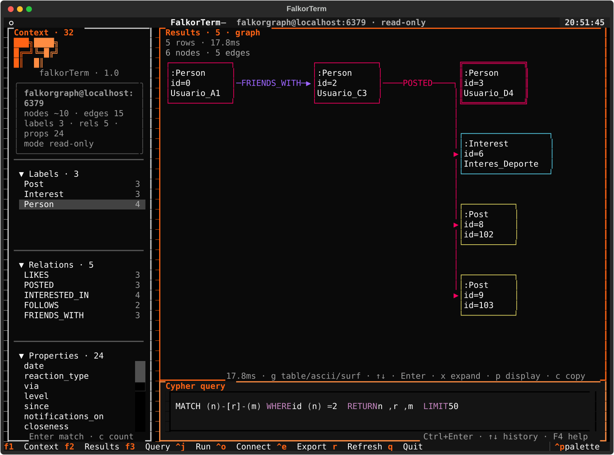

# FalkorTerm

TUI client ([Textual](https://textual.textualize.io/)) for [FalkorDB](https://www.falkordb.com/): explore labels and relationships, write Cypher, and view results as a table or graph.



## Requirements

- Python ≥ 3.12
- Docker (optional, for a local FalkorDB)
- A reachable FalkorDB instance (default `localhost:6379`)

## Installation

```bash
uv sync --extra dev
cp .env.example .env   # if you do not already have a .env
```

## Local FalkorDB (Docker)

```bash
docker compose up -d --build
```

- Server: `localhost:6379`
- Browser UI: http://localhost:3000

```bash
docker compose down          # stop
docker compose down -v       # stop and wipe data
```

## Usage

Load variables from `.env` (they prefill the connection screen) and start the TUI:

```bash
set -a && source .env && set +a
uv run falkorterm
# or
uv run python -m falkorterm
```

On launch you get the **connection screen**. Use **Connect** to list graphs and **Open** to enter one. You can save named profiles (host/port/password/graph/read-only); if a `default` profile exists, it is applied on open. Press `Ctrl+o` to switch graph or server without restarting.

Skip the connection screen when host/graph are already known:

```bash
uv run falkorterm --profile local --skip-connect
uv run falkorterm --host 127.0.0.1 --graph social --skip-connect
```

Enable **Read-only** (or `FALKOR_READ_ONLY=1`) to block write queries in the client (this is not a server ACL). Without read-only, writes (`CREATE`, `MERGE`, `DELETE`, etc.) ask for confirmation. The editor suggests labels/relationships/properties from the schema (accept with the right arrow).

### CLI

`falkorterm` with no arguments (or `tui`) opens the TUI. Connection flags apply to both the TUI and headless commands. Precedence: **flags > `--profile` > env `FALKOR_*` > defaults**.

```bash
uv run falkorterm --help
```

#### Commands

| Command | Description |
|---------|-------------|
| _(none)_ / `tui` | Open the interactive TUI |
| `graphs` | List graphs on the server |
| `schema` | Print labels, relationships, property keys, and counts |
| `ping` | Connect and run `RETURN 1` |

#### Connection flags

| Flag | Default | Description |
|------|---------|-------------|
| `-H`, `--host` | `FALKOR_HOST` / `localhost` | FalkorDB host |
| `-P`, `--port` | `FALKOR_PORT` / `6379` | FalkorDB port |
| `-g`, `--graph` | `FALKOR_GRAPH` / `falkorterm` | Graph name |
| `--password-file PATH` | `FALKOR_PASSWORD` | Read the password from a file (avoids exposing it in `ps`) |
| `--profile NAME` | | Named connection profile from `profiles.json` |
| `-r`, `--read-only` | `FALKOR_READ_ONLY` | Block write queries in the client (not a server ACL) |
| `--timeout MS` | `FALKOR_TIMEOUT_MS` / `30000` | Query timeout in milliseconds |
| `--max-rows N` | `FALKOR_MAX_ROWS` / `500` | Max rows returned to the client |
| `--skip-connect` | off | TUI only: connect with resolved settings and skip the connection screen |
| `--version` | | Print the version and exit |

#### Query and output flags

| Flag | Default | Description |
|------|---------|-------------|
| `-q`, `--query CYPHER` | | Run Cypher headless; `-q -` reads stdin |
| `-f`, `--query-file PATH` | | Read Cypher from a file (mutually exclusive with `-q`) |
| `-o`, `--format` | `table` on a TTY, `json` when piped | `table`, `csv`, `tsv`, or `json` |
| `--output PATH` | stdout | Write query results to a file |
| `--no-header` | off | Omit the column header in `csv` / `tsv` |
| `-y`, `--yes` | off | Confirm write queries in headless mode (no TUI modal) |
| `--no-color` | off (also respects `NO_COLOR`) | Disable color in `table` output |
| `--output-diagram PATH` | | Write an ASCII graph to `PATH`; `-` is stdout |
| `--diagram-style` | `ascii` | `ascii` (boxed layout) or `edges` (`(1)-[:KNOWS]->(2)`) |
| `--diagram-only` | off | Do not print the tabular result |
| `--max-nodes N` | `25` | Max nodes included in the diagram |
| `--max-edges N` | `40` | Max edges included in the diagram |

`--output-diagram -` cannot share stdout with the result table unless you also pass `--diagram-only`. If the result has no nodes/edges, the command exits `4`. Write queries without `--yes` exit `3`; `--read-only` blocks them even with `--yes`.

#### Exit codes

| Code | Meaning |
|------|---------|
| `0` | Success |
| `1` | Cypher / query error |
| `2` | Usage error or connection failure |
| `3` | Write blocked (`--read-only` or missing `--yes`) |
| `4` | `--output-diagram` requested but the result is not a graph |

Results go to stdout; errors and warnings (e.g. `truncated`) go to stderr.

#### Examples

```bash
# TUI
uv run falkorterm
uv run falkorterm --profile local --skip-connect
uv run falkorterm --host 127.0.0.1 --graph social --skip-connect

# One-shot query
uv run falkorterm -q 'MATCH (n:Person) RETURN n.name LIMIT 10'
uv run falkorterm -f query.cypher --format csv --output people.csv
echo 'RETURN 1' | uv run falkorterm -q - --format json
uv run falkorterm -q 'MATCH (n) RETURN n.name' --format tsv --no-header
uv run falkorterm -q 'CREATE (n:Person {name: "Ada"})' --yes

# ASCII diagram
uv run falkorterm -q 'MATCH (a)-[r]->(b) RETURN a,r,b LIMIT 40' \
  --output-diagram graph.txt
uv run falkorterm -q 'MATCH (a)-[r]->(b) RETURN a,r,b' \
  --diagram-only --diagram-style edges
uv run falkorterm -q 'MATCH (a)-[r]->(b) RETURN a,r,b' \
  --format json --output-diagram graph.txt --max-nodes 100 --max-edges 200

# Inspect
uv run falkorterm graphs
uv run falkorterm schema --format json
uv run falkorterm ping --host 127.0.0.1 --port 6379
```

### Browser (`textual serve`)

To open the same TUI in a browser (via [textual-serve](https://github.com/Textualize/textual-serve)), load `.env` as above and run:

```bash
set -a && source .env && set +a
uv run textual serve "python -m falkorterm"
```

Then open http://localhost:8000. Useful flags: `-p` / `--port` for another port, `-h` / `--host` to bind a different interface, `--dev` for Textual DevTools.

### Environment variables

| Variable | Default | Description |
|----------|---------|-------------|
| `FALKOR_HOST` | `localhost` | Host (prefill) |
| `FALKOR_PORT` | `6379` | Port (prefill) |
| `FALKOR_GRAPH` | `falkorterm` | Graph name (prefill) |
| `FALKOR_PASSWORD` | _(empty)_ | Redis/FalkorDB password |
| `FALKOR_TIMEOUT_MS` | `30000` | Query timeout (ms) |
| `FALKOR_MAX_ROWS` | `500` | Max rows in the results table |
| `FALKOR_READ_ONLY` | _(off)_ | `1`/`true`/`yes`/`on` → read-only connection |
| `FALKOR_HISTORY_PATH` | _(XDG data)_ | Cypher history path |
| `FALKOR_EXPORT_DIR` | _(XDG data)/exports_ | CSV/JSON export directory |
| `FALKOR_PROFILES_PATH` | _(XDG data)/profiles.json_ | Saved connection profiles |

Profile passwords are stored in plain text in the JSON (same risk as `.env`).

Example:

```bash
FALKOR_GRAPH=social FALKOR_HOST=127.0.0.1 uv run falkorterm
```

### Themes

The default is **flux-3** (fuchsia / magenta / amber). Also available: `flux-1` (fuchsia only), `flux-2` (fuchsia + cyan), `luan` (neon cyan/purple on black), `rhodia` (black/white + Dotpad orange), and `falkorterm` (teal). Switch themes with Textual’s Command Palette (`Ctrl+P` → *Change theme*).

### Shortcuts

| Key | Action |
|-----|--------|
| `F1` / `Ctrl+1` | Focus Context |
| `F2` / `Ctrl+2` | Focus Results |
| `F3` / `Ctrl+3` | Focus Query |
| `Ctrl+Enter` / `Ctrl+J` | Run Cypher |
| `Ctrl+o` | Open connection screen / switch graph (in Surf: jump back) |
| `Ctrl+e` | Export results (CSV or JSON) |
| `Ctrl+Shift+C` | Copy query to clipboard |
| `F4` / `Ctrl+Shift+H` (in Query) | Open Cypher cheatsheet (FalkorDB) |
| `Esc` | Cancel in-flight query (closes connection and reconnects) |
| `r` | Refresh schema (or reopen connection if it failed) |
| `q` | Quit |
| `y` / `Y` (in Results) | Copy cell / row (TSV) |
| `g` (in Results) | Cycle table → ASCII graph → Surf |
| `c` (in graph/Surf, F2 focused) | Copy ASCII diagram or Surf to clipboard |
| `Enter` (in Context) | Insert MATCH / property template into the editor |
| `c` (in Context) | Insert `count` template for the focused label/relationship |
| `Enter` (in Results) | Inspect cell / node |
| `x` (detail / graph) | Expand node neighbors (inserts Cypher and runs it) |
| `j`/`k`, `l`, `h`/`Ctrl+o`, `L`, `Tab` (in Surf) | Move cursor, jump, history back/forward, toggle node/edge |

Surf is a dense ego-hop inspector (FOCUS box, aligned OUT/IN, `selected` panel, contextual hints); it does not draw the full graph in ASCII.

To paste outside the terminal on Wayland you need [`wl-clipboard`](https://github.com/bugaevc/wl-clipboard) (`wl-copy`); on X11, `xclip` or `xsel`. Without that, OSC 52 often fails (e.g. in Cursor).

## Tests

```bash
uv run pytest -v
```

## Layout

- **Context** (left): labels, relationships, property keys
- **Results** (top right): results table, ASCII graph or Surf (`g`), or errors
- **Query** (bottom right): Cypher editor
