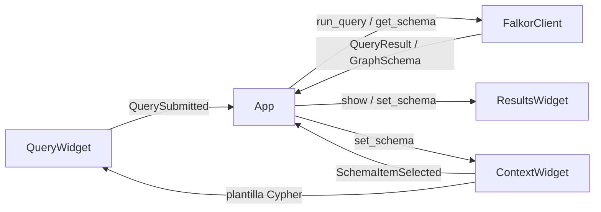

# FalkorTerm MVP — Plan de implementación

> **For agentic workers:** REQUIRED SUB-SKILL: Use `superpowers:subagent-driven-development` (recommended) or `superpowers:executing-plans` task-by-task. Steps use checkbox (`- [ ]`) syntax for tracking.

**Goal:** Cliente TUI (Textual + Rich) para FalkorDB: ver schema (labels/relations), escribir Cypher y ver resultados tabulares.

**Architecture:** Widgets Textual desacoplados vía mensajes; `FalkorClient` encapsula el SDK `falkordb`; `FalkorTerm` orquesta workers async. Sin vista grafo en este plan (fase 5 posterior).

**Tech Stack:** Python ≥3.12, Textual `[syntax]` ≥8.2, `falkordb`, `pytest`, `uv`.

## Global Constraints

- Layout fijo del wireframe: Context (izq) | Results (arriba der) | Query (abajo der)
- Conexión solo por env/CLI (sin `ConnectionScreen` en MVP)
- Timeout query default 30s; máximo 500 filas en tabla (truncar + aviso)
- Historial Cypher solo en memoria
- Grafo ASCII explícitamente fuera de alcance
- Responder/documentar en español donde aplique a docs de usuario; código e IDs en inglés

## Entrega de documentación (al iniciar ejecución)

Escribir este plan en:

- `/home/REDACTED/Documentos/falkorterm_docs/2026-07-30-falkorterm-mvp-plan.md`
- Opcional espejo en repo: `docs/superpowers/plans/2026-07-30-falkorterm-mvp.md`

También un spec corto de diseño acordado en:

- `/home/REDACTED/Documentos/falkorterm_docs/2026-07-30-falkorterm-design.md`

## Estructura de archivos (objetivo)

```
src/falkorterm/
  __init__.py
  __main__.py          # python -m falkorterm
  app.py               # FalkorTerm + message handlers + workers
  config.py            # ConnectionConfig from env/CLI
  client/
    falkor.py          # FalkorClient
    models.py          # dataclasses + domain errors
  widgets/
    context.py
    results.py         # ResultsWidget + TableResultView
    query.py
  styles/app.tcss
tests/
  test_models.py
  test_client.py
  test_widgets_*.py
pyproject.toml         # package src layout + deps + scripts
```

Sustituir el tutorial stopwatch (`main.py`, `stopwatch.tcss`) por el layout anterior.

## Flujo



## Interfaces canónicas

```python
# models
@dataclass(frozen=True)
class ConnectionConfig:
    host: str = "localhost"
    port: int = 6379
    graph: str = "falkorterm"
    password: str | None = None
    timeout_ms: int = 30_000
    max_rows: int = 500

@dataclass(frozen=True)
class GraphSchema:
    labels: tuple[str, ...]
    relations: tuple[str, ...]

@dataclass(frozen=True)
class QueryResult:
    columns: tuple[str, ...]
    rows: tuple[tuple[object, ...], ...]
    truncated: bool = False
    total_rows: int = 0

class FalkorConnectionError(Exception): ...
class FalkorQueryError(Exception): ...

# FalkorClient
class FalkorClient:
    def connect(self, config: ConnectionConfig) -> None: ...
    def disconnect(self) -> None: ...
    def get_schema(self) -> GraphSchema: ...
    def run_query(self, cypher: str) -> QueryResult: ...

# Messages (Textual Message)
class QuerySubmitted(Message):
    cypher: str

class SchemaItemSelected(Message):
    kind: Literal["label", "relation"]
    name: str
```

SDK real: `FalkorDB(host=..., port=..., password=...).select_graph(name)` → `graph.query(q, timeout=ms)`; schema vía Cypher `CALL db.labels()` / `CALL db.relationshipTypes()`.

---

### Task 0: Documentación del plan/spec

- [x] Copiar plan + spec de diseño
- [ ] Commit solo si el usuario lo pide

### Task 1: Scaffold del paquete y layout UI vacío

### Task 2: Modelos de dominio + config

### Task 3: FalkorClient (con fake para tests)

### Task 4: QueryWidget + Results tabla + cableado en App

### Task 5: ContextWidget + plantillas + refresh schema

### Task 6: Conexión al arranque, status UI, pulido MVP

### Task 7 (fuera de este MVP): GraphResultView

No implementar aquí.

## Criterio de hecho (MVP)

1. Arranca y conecta con env/CLI
2. Muestra labels/relations
3. Ejecuta Cypher y muestra tabla (≤500 filas)
4. Context inserta plantilla
5. Errores de query/conexión no tumban la app
